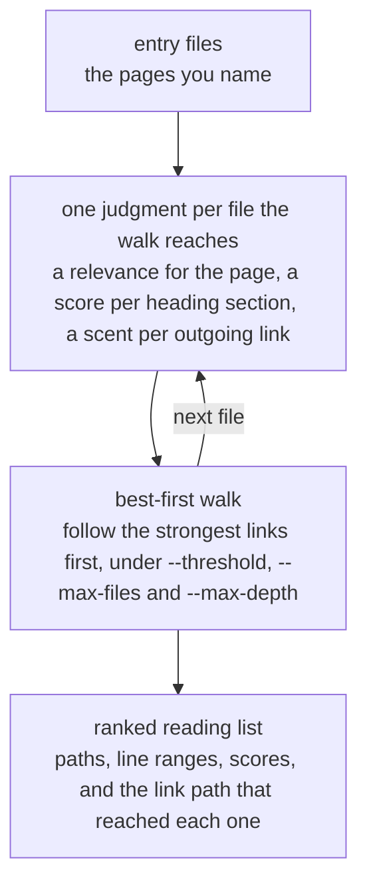
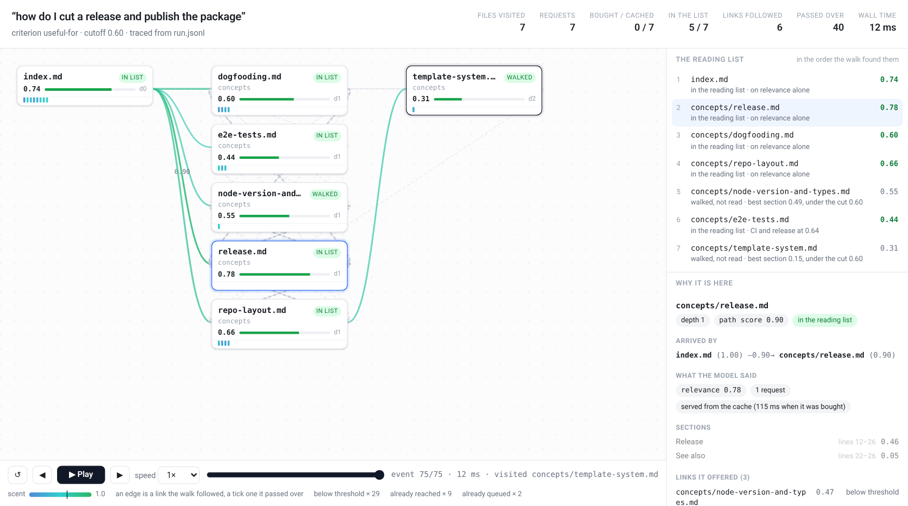

# s1m

**High-efficiency knowledge recall from an LLM wiki, powered by Jev.**

Point s1m at an LLM wiki with a query. From the page you name, it walks the wiki's links, and at
every step Jev judges the page it has just reached for that query: how relevant it is, which of
its sections matter, and how promising each of its outgoing links looks. Those judgements steer
the next step, so the walk branches out along the strongest links and leaves the weak ones
unread, and every useful document and section it passes is recorded as it goes. When no
promising link is left it stops and hands back that record: a ranked reading list of files and
line ranges, ready for an agent to open.

[](https://github.com/mikekelly/s1m/actions/workflows/ci.yml)
[](LICENSE)
[](Cargo.toml)

| | How it finds a page | What that costs |
| --- | --- | --- |
| LLM agent exploring | Opens pages until it finds the right one | The context window — spent on what is a string of quick relevance calls |
| **s1m** | Judges meaning *and* follows the links: one small judgment per file the walk reaches, per section and per link, best-first | One cheap judgment per file the walk visits — and it returns line ranges, not whole pages |

The last two of those have been measured against each other: 20 labelled queries on one
1,933-page wiki, 60 runs a condition, in
[`eval/PRIVATE_WIKI_REPORT.md`](eval/PRIVATE_WIKI_REPORT.md). Every cell is a mean over those
runs; s1m's cold figures are the 20 runs that were measured cold.

| Measured | Runs | Recall | Precision | Cost a query | Wall | Tokens |
| --- | --- | --- | --- | --- | --- | --- |
| Claude Code **Explore**, sonnet ([row](eval/PRIVATE_WIKI_REPORT.md#results)) | 60 | 0.85 | 0.17 | $0.29 | 78 s | ~310k read |
| **s1m** at today's defaults ([row](eval/PRIVATE_WIKI_REPORT.md#reading-the-numbers)) | 60 warm, 20 cold | 0.87 | 0.21 | $0.03 cold, $0 warm | 1.9 s cold, 0.2 s warm | ~15k handed to the agent |

The name is short for **System 1 memex** — after Vannevar Bush's memex, which followed
associative trails through linked documents.

## Quickstart

```bash
# macOS or Linux, no Rust toolchain: the installer detects the platform,
# checks the archive against its SHA-256, and writes `s1m` to $XDG_BIN_HOME,
# or to ~/.local/bin when that is unset. It never needs sudo.
curl --proto '=https' --tlsv1.2 -LsSf \
  https://github.com/mikekelly/s1m/releases/latest/download/s1m-installer.sh | sh

# Run it on the wiki vendored in this repository. No API key needed: the answers
# are in the committed cache, which is why the run reports 0 calls.
git clone https://github.com/mikekelly/s1m
cd s1m
S1M_CACHE_DIR=eval/cache s1m --format md \
  "how do I cut a release and publish the package" \
  eval/wikis/llm-wiki-manager/wiki/index.md
```

Two other ways in, for anyone who would rather not pipe a script into a shell. Pin the version —
the installer is pinned to the release it came from, and resolves nothing through `latest`:

```bash
curl --proto '=https' --tlsv1.2 -LsSf \
  https://github.com/mikekelly/s1m/releases/download/v0.1.0/s1m-installer.sh | sh
```

Or take the archive for your platform and its `.sha256` from the
[releases page](https://github.com/mikekelly/s1m/releases), or build from source with stable
Rust — edition 2024, rustc 1.85 or newer, and not published to crates.io, so:

```bash
cargo install --git https://github.com/mikekelly/s1m
```

`$S1M_INSTALL_DIR` overrides the install directory, and
[Install](docs/reference.md#install) has the targets the releases carry and the rest.

```markdown
# Reading list: how do I cut a release and publish the package

Criterion: useful-for; 7 files visited, 0 calls

## 1. `eval/wikis/llm-wiki-manager/wiki/concepts/release.md`

relevance 0.78; scent 0.90; via `eval/wikis/llm-wiki-manager/wiki/index.md`

- nothing above --threshold

## 2. `eval/wikis/llm-wiki-manager/wiki/index.md`

relevance 0.74; entry file

- nothing above --threshold

## 3. `eval/wikis/llm-wiki-manager/wiki/concepts/repo-layout.md`

relevance 0.66; scent 0.78; via `eval/wikis/llm-wiki-manager/wiki/index.md`

- nothing above --threshold

## 4. `eval/wikis/llm-wiki-manager/wiki/concepts/dogfooding.md`

relevance 0.60; scent 0.82; via `eval/wikis/llm-wiki-manager/wiki/index.md`

- nothing above --threshold

## 5. `eval/wikis/llm-wiki-manager/wiki/concepts/e2e-tests.md`

relevance 0.44; scent 0.64; via `eval/wikis/llm-wiki-manager/wiki/index.md`

- lines 78-83, score 0.64, CI and release
```

Drop `--format md` for the JSON a program parses, or ask for `--format tree` to see the whole
walk. On your own wiki it is `s1m "<query>" <entry-file>...` with a key in `TYPESAFE_API_KEY`
(see [`.env.example`](.env.example)); every other flag has a default that is right for a first
run, and all of them are in [the reference](docs/reference.md#use).

## Your content leaves the machine

Scoring calls send the query and the content of the files visited to the TypeSafe API. The key
is read from `TYPESAFE_API_KEY`; see [`.env.example`](.env.example). Do not point s1m at a
knowledge base you are not willing to send to a third party. A root whose wiki has pages that
must not go can say so in
[`.s1mignore`](docs/reference.md#keeping-paths-out-of-it-s1mignore) — gitignore syntax, in the
root the walk is bounded by:

```text
# Nothing under private/ leaves this machine.
private/
```

A matched path is never read: not sent, not previewed, not followed, and naming one as an entry
file exits 2.

## How it works



The walk stops when the budgets run out or no link is left above the threshold. A file earns a
place on its own — relevance at or above `--threshold`, or at least one section at or above it —
and every other file it passed through is reported under `walked`, so the walk stays
explainable without handing the caller pages not to read.

## Docs

| | |
| --- | --- |
| [`docs/reference.md`](docs/reference.md) | The whole interface: install, the reading list's shape, every flag, the trace, the output formats, the criteria, `.s1mignore`, the cache, the library and the development commands |
| [`docs/initial-plan.md`](docs/initial-plan.md) | The design and the plan goals: why a walk, what each request carries, the defaults and where they came from |
| [`docs/spike-notes.md`](docs/spike-notes.md) | What the Jev calls cost and how they read on real pages — the measurements the design rests on |
| [`eval/REPORT.md`](eval/REPORT.md) | What the ranking is worth on a real wiki: recall, precision, tokens read and dollars spent over 20 labelled queries |
| [`eval/PRIVATE_WIKI_REPORT.md`](eval/PRIVATE_WIKI_REPORT.md) | That harness's run on a 1,933-page wiki — s1m against a Claude Code Explore agent, in numbers only: the wiki, the queries and the pages they name stay out of the file |
| [`eval/agent/README.md`](eval/agent/README.md) | The second harness: the same reading list measured against a Claude Code Explore agent, on any wiki, with nothing about it committed |
| [`SKILL.md`](SKILL.md) | The skill file — what an agent needs to know to reach for s1m and read the result |

## Demo: the walk as it happened

The same keyless run under `--format tree`: every file the walk visited and, under each one,
every link the model judged, highest scent first, with what the walk did about it.

```bash
S1M_CACHE_DIR=eval/cache s1m --format tree \
  "how do I cut a release and publish the package" \
  eval/wikis/llm-wiki-manager/wiki/index.md
```

```text
how do I cut a release and publish the package (useful-for); 7 files visited, 0 calls

eval/wikis/llm-wiki-manager/wiki/index.md  entry file; relevance 0.74
  eval/wikis/llm-wiki-manager/wiki/concepts/release.md  followed; scent 0.90; relevance 0.78
    eval/wikis/llm-wiki-manager/wiki/concepts/repo-layout.md  pruned; scent 0.58
    eval/wikis/llm-wiki-manager/wiki/concepts/node-version-and-types.md  pruned; scent 0.47
    eval/wikis/llm-wiki-manager/wiki/concepts/dogfooding.md  pruned; scent 0.42
  eval/wikis/llm-wiki-manager/wiki/concepts/dogfooding.md  followed; scent 0.82; relevance 0.60
    eval/wikis/llm-wiki-manager/wiki/concepts/release.md  already reached; scent 0.92
    eval/wikis/llm-wiki-manager/wiki/concepts/repo-layout.md  pruned; scent 0.80
    eval/wikis/llm-wiki-manager/wiki/concepts/node-version-and-types.md  pruned; scent 0.62
    eval/wikis/llm-wiki-manager/wiki/concepts/unit-tests.md  pruned; scent 0.31
    eval/wikis/llm-wiki-manager/wiki/concepts/wiki-scripts.md  pruned; scent 0.30
    eval/wikis/llm-wiki-manager/wiki/concepts/template-system.md  pruned; scent 0.23
    eval/wikis/llm-wiki-manager/wiki/concepts/init-command.md  pruned; scent 0.19
    eval/wikis/llm-wiki-manager/wiki/AGENTS.md  pruned; scent 0.17
  eval/wikis/llm-wiki-manager/wiki/concepts/repo-layout.md  followed; scent 0.78; relevance 0.66
    eval/wikis/llm-wiki-manager/wiki/concepts/release.md  already reached; scent 0.93
    eval/wikis/llm-wiki-manager/wiki/concepts/dogfooding.md  already reached; scent 0.77
    eval/wikis/llm-wiki-manager/wiki/concepts/template-system.md  followed; scent 0.72; relevance 0.31
      eval/wikis/llm-wiki-manager/wiki/concepts/repo-layout.md  already reached; scent 0.86
      eval/wikis/llm-wiki-manager/wiki/concepts/dogfooding.md  already reached; scent 0.80
      eval/wikis/llm-wiki-manager/wiki/concepts/init-command.md  pruned; scent 0.27
    eval/wikis/llm-wiki-manager/wiki/concepts/node-version-and-types.md  pruned; scent 0.52
    eval/wikis/llm-wiki-manager/wiki/concepts/unit-tests.md  pruned; scent 0.36
    eval/wikis/llm-wiki-manager/wiki/concepts/e2e-tests.md  pruned; scent 0.33
    eval/wikis/llm-wiki-manager/wiki/concepts/wiki-scripts.md  pruned; scent 0.32
    eval/wikis/llm-wiki-manager/wiki/concepts/init-command.md  pruned; scent 0.22
    eval/wikis/llm-wiki-manager/wiki/AGENTS.md  pruned; scent 0.19
  eval/wikis/llm-wiki-manager/wiki/concepts/node-version-and-types.md  followed; scent 0.70; relevance 0.55
    eval/wikis/llm-wiki-manager/wiki/concepts/release.md  already reached; scent 0.92
    eval/wikis/llm-wiki-manager/wiki/concepts/repo-layout.md  already reached; scent 0.85
    eval/wikis/llm-wiki-manager/wiki/concepts/dogfooding.md  already reached; scent 0.80
    eval/wikis/llm-wiki-manager/wiki/concepts/e2e-tests.md  pruned; scent 0.53
    eval/wikis/llm-wiki-manager/wiki/concepts/unit-tests.md  pruned; scent 0.53
  eval/wikis/llm-wiki-manager/wiki/concepts/e2e-tests.md  followed; scent 0.64; relevance 0.44
    eval/wikis/llm-wiki-manager/wiki/concepts/dogfooding.md  already reached; scent 0.76
    eval/wikis/llm-wiki-manager/wiki/concepts/unit-tests.md  pruned; scent 0.54
    eval/wikis/llm-wiki-manager/wiki/entities/commands.md  pruned; scent 0.40
    eval/wikis/llm-wiki-manager/wiki/concepts/init-command.md  pruned; scent 0.31
  eval/wikis/llm-wiki-manager/wiki/concepts/unit-tests.md  pruned; scent 0.58
  eval/wikis/llm-wiki-manager/wiki/concepts/init-command.md  pruned; scent 0.52
  eval/wikis/llm-wiki-manager/wiki/concepts/template-system.md  pruned; scent 0.51
  eval/wikis/llm-wiki-manager/wiki/concepts/wiki-scripts.md  pruned; scent 0.51
  eval/wikis/llm-wiki-manager/wiki/entities/cli.md  pruned; scent 0.48
  eval/wikis/llm-wiki-manager/wiki/entities/commands.md  pruned; scent 0.37
  eval/wikis/llm-wiki-manager/wiki/entities/utils.md  pruned; scent 0.28
  eval/wikis/llm-wiki-manager/wiki/entities/templates.md  pruned; scent 0.20
  eval/wikis/llm-wiki-manager/wiki/raw/raw.md  pruned; scent 0.07
```

That is the whole capture, nothing elided: seven files judged out of nineteen, five of them
worth reading. `release.md` is the best page and the entry follows the link at 0.90;
`dogfooding.md`'s stronger-looking link to it, at 0.92, says `already reached`, because a file
is visited once, along the best path found to it. What each mark means is in
[Output formats](docs/reference.md#output-formats).

That is the walk as a tree; the same run plays back. `s1m --trace run.jsonl …` writes what the
walk did as it did it, and `s1m play run.jsonl` draws that trace as one page: the files appearing
as the walk pops them, the links it followed beside the ones it passed over, the reading list
filling in, and the evidence for any file a click away. It is a local file — no server, no
request, nothing fetched — and [the reference](docs/reference.md#playing-a-trace) has the rest.



## The reference, area by area

Everything below is in [`docs/reference.md`](docs/reference.md), one click away and complete.

**[Install](docs/reference.md#install)** — the prebuilt installer for macOS and Linux, the
release archives and checksums it fetches, `cargo install --git`, `cargo install --path .` from a
checkout, or `cargo build --release` and the binary at `target/release/s1m`; and the key the
scoring calls need.

**[The reading list, and every flag](docs/reference.md#use)** — the JSON the run prints, field by
field, and what each one is for: `results` against `walked`, `sections` as the `[first, last]`
lines to read, `scent` and `via`, the `reason` a link queued nothing, how a path is spelled, and
the exit codes. The flag table with every default and what moves it, and where the `--threshold`
and `--max-files` defaults came from.

**[Hidden flags](docs/reference.md#hidden-flags)** — the experiments the issues track rather than
the interface: the preview ablations, `--scorer choice` with its share cut and its beam, the nine
`--wording` registers and what each of them changed, and `--trace`.

**[The trace of a run](docs/reference.md#the-trace-of-a-run)** — `--trace FILE`, one JSON object
per line, every event and its fields, and what a replay can and cannot conclude from it.

**[Playing a trace](docs/reference.md#playing-a-trace)** — `s1m play TRACE` draws that trace as
one self-contained HTML page: the crawl, the links the walk passed over and why, the reading list
filling in, and the evidence for any file a click away.

**[Output formats](docs/reference.md#output-formats)** — `json` to parse, `md` to read or paste,
`tree` for the walk itself, with the three marks a link can carry and what both views round.

**[Relevance modes](docs/reference.md#relevance-modes)** and
**[custom criteria](docs/reference.md#custom-criteria)** — `about`, `useful-for` and `answers`,
what each asks the model, and `--criteria FILE` when the judgment you need is none of them.

**[What is sent about each link](docs/reference.md#what-is-sent-about-each-link)** — the anchor,
the sentence, the heading and the target's preview, each part with its bound, what the lookahead
is worth in recall, and what it costs in tokens.

**[Keeping paths out of it:
`.s1mignore`](docs/reference.md#keeping-paths-out-of-it-s1mignore)** — gitignore syntax in the
root, what a matched path stops, what it does *not* stop, the three consequences worth knowing,
and the exit codes in full.

**[Environment](docs/reference.md#environment)** — `TYPESAFE_API_KEY`, `S1M_CACHE_DIR` and
`S1M_ENDPOINT`, and which of them are part of a cache key.

**[Debug view of one file](docs/reference.md#debug-view-of-one-file)** — `s1m score-file`, the
spike's own view of one request: the model, the questions, the tokens, the latency and the cost,
then a row per section and per link.

**[Cache](docs/reference.md#cache)** — why repeat runs are identical and free, what goes into the
key, what `calls` counts, and when to delete the directory.

**[Evaluation](docs/reference.md#evaluation)** — the harness, and the headline it produced on the
vendored wiki: mean recall 0.83 at mean precision 0.27 over 20 labelled queries, section recall
0.74, 44,906 tokens read against 346,160 for the corpus, at $0.002297 a query. The numbers
themselves are in [`eval/REPORT.md`](eval/REPORT.md).

**[Library](docs/reference.md#library)** — `parse`, `ignore`, `scorer`, `jev`, `cache`,
`traverse`, `cli` and `format` reachable without the CLI, item by item, and the fixtures the
tests drive them over.

**[Development](docs/reference.md#development)** and
**[what it is built on](docs/reference.md#what-it-is-built-on)** — the commands, what CI runs,
the one test that leaves the machine, and which issue delivered each piece.

## Contributing

Issues and pull requests are welcome at
[github.com/mikekelly/s1m](https://github.com/mikekelly/s1m/issues). Open an issue first for
anything that changes behaviour: the acceptance criteria are agreed on the issue and the PR
closes it.

[`AGENTS.md`](AGENTS.md) holds the rules for any coding session on this repository, and
[`SSF.md`](SSF.md) describes the factory that works on it — who decides what, when to post, and
how a change is reviewed and merged. Write the test first, and add a dependency only with the
issue that needs it.

Before opening a PR, run what CI runs ([.github/workflows/ci.yml](.github/workflows/ci.yml)):

```bash
cargo fmt --all --check
cargo clippy --locked --all-targets -- -D warnings
cargo test --locked
cargo build --locked
```

CI runs those four on the stable toolchain, then a smoke test on the built binary: `--help`
prints usage, no arguments exits 2 with usage on stderr, an unknown flag exits 2.

## License

MIT — see [LICENSE](LICENSE). Copyright Mike Kelly 2026.
