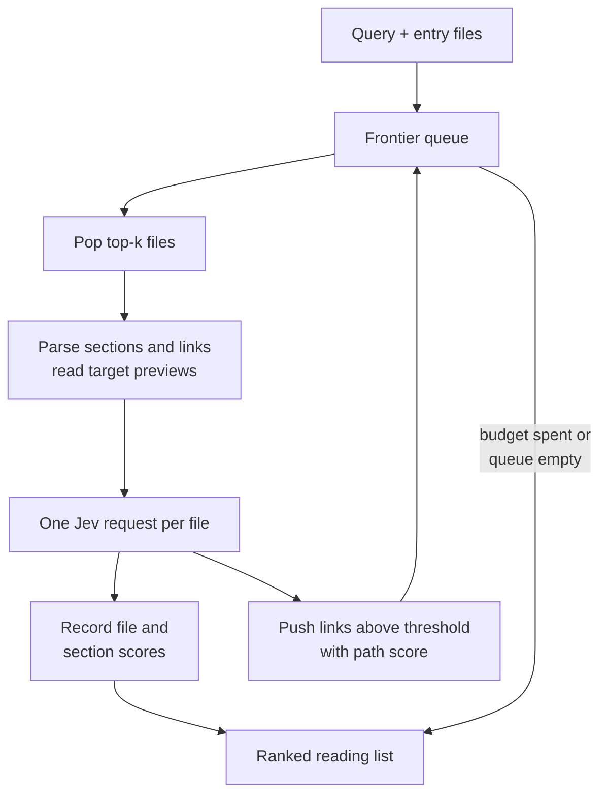

# s1m: System 1 memex

## Elevator pitch

s1m is a CLI that finds the parts of a markdown knowledge base relevant to a query by walking its links, so an LLM agent reads only what matters.

You give it a query and one or more entry point files. It scores each file and each outgoing link with a fast judgment model ([Jev](https://raw.githubusercontent.com/typesafe-ai/skills/main/skills/typesafe-ai/SKILL.md), TypeSafe's System One model), follows the most promising links first, and returns a ranked reading list with paths, line ranges and scores.

The name expands to "System 1 memex". Vannevar Bush's memex followed associative trails through linked documents. s1m does the same over an LLM wiki, with a System One model supplying the associations.

## Why

Agents navigating a wiki spend their most expensive resource, context, on the cheapest kind of work. To find three useful pages an agent typically opens ten, and every page it opens stays in its context for the rest of the task.

The existing alternatives each miss something:

- **Grep and keyword search** match wording, not meaning, and ignore the link structure the wiki's authors built.
- **Embedding search** needs an index kept in sync, and returns isolated chunks with no sense of how pages relate.
- **Letting the agent browse** works, but burns context and turns on a reasoning model for what is a string of quick relevance calls.

Navigation is a System One task. Deciding whether a link is worth following is a fast, intuitive judgment, not a reasoning problem. Jev returns calibrated probabilities rather than generated text, and it is cheap enough to score every link on every page visited. TypeSafe's [reranking cookbook](https://docs.typesafe.ai/cookbooks/rerank_typesafe.md) reports 1,200 scoring calls for $0.0645, at $0.042 per million input tokens for jev-1.12 as of August 2026.

The idea has a research basis. Information foraging theory (Pirolli and Card) describes how people navigate by "information scent": cues on a link that predict the value of following it. s1m makes scent an explicit, computed number.

## Design goals

1. **Save the caller's context.** Output is a reading list with line ranges, not file contents. The agent decides what to open.
2. **Code owns the workflow.** Traversal, budgets, caching and ranking are ordinary code. The model only answers narrow relevance questions.
3. **Query-neutral.** The input is a free-text query: a topic, a question or a task description. How relevance is judged is a separate, swappable criterion.
4. **No index, no setup.** It works on any folder of markdown or text files with links. Nothing to build or keep in sync.
5. **Bounded and predictable.** Hard limits on files, depth and model calls. The same query on the same files returns the same result.
6. **Explainable results.** Every file in the output carries its score and the link path that reached it.
7. **Agent-first interface.** JSON by default, a one-line description an agent can act on, non-interactive, meaningful exit codes.

### Non-goals

- Not a search engine over unlinked corpora. It follows structure that exists.
- Not a summariser or question answerer. It generates no text.
- Not a wiki builder, linter or memory store.
- Not tied to one wiki format beyond markdown links and wikilinks in v1.

## How it works

s1m is best-first graph search with Jev as the heuristic. It keeps a priority queue of unvisited files, expands the highest-scoring ones, and stops when the budget runs out or nothing left clears the threshold.



Each round expands the top-k frontier files concurrently, so latency is one round trip per hop rather than per file.

### One request per file

Jev answers independent questions over the same state in parallel, so each visited file is a single request. The state holds the query, the file's path, title and content, and for every outgoing link its anchor text, surrounding sentence, enclosing heading, and a preview of the target (title, frontmatter, first paragraph) read from disk.

| Judgment | Primitive | Question | Used for |
| --- | --- | --- | --- |
| File relevance | Score | How useful is this file for the query: central, supporting, tangential, unrelated | Ranking the output |
| Section relevance | Noul per heading section | Is this section useful for the query | Line ranges in the output |
| Link scent | Noul per outgoing link | Is following this link likely to reach useful content | Frontier priority and pruning |

File relevance and link scent are deliberately separate. Index and hub pages are usually irrelevant themselves but link to what matters, so s1m never prunes a file's links because the file scored low.

### Relevance modes

The query text goes in the state. The mode selects which instructions and criteria are sent.

| Mode | Criterion | Typical use |
| --- | --- | --- |
| `about` | The content is on the subject of the query | Browsing, collecting everything on a subject |
| `useful-for` | The content would help someone doing what the query describes | Agents with a task |
| `answers` | The content contains the answer to the query | Question lookup |

Custom criteria can be supplied from a file for anything else.

### Scoring and pruning

- A frontier entry's priority is its path score: the product of link scents along the best path found so far, so long chains of weak links fade out.
- A link is queued only if its scent clears `--threshold`. A Noul near 0.5 means uncertain, not moderately relevant, so the default threshold sits above it and is tuned on real data.
- A file reached by several paths keeps its best path score and is visited once.
- Optional seeding: `--seed-grep` adds the top keyword hits as extra entry points, which recovers relevant pages that are orphaned or poorly linked.

### Caching

Answers are cached on the hash of file content, query, mode and question. A wiki changes slowly and agents ask overlapping things, so repeat runs are close to free and fully deterministic.

## Interface

One command, a query, and one or more entry files. Flag names and defaults below are proposals.

```bash
s1m "how do we handle settlement timing for instant payouts" wiki/index.md
s1m --mode about --max-files 40 --format tree "chargebacks" wiki/index.md wiki/payments/README.md
```

| Flag | Default | Meaning |
| --- | --- | --- |
| `--mode` | `useful-for` | Relevance criterion: `about`, `useful-for`, `answers` |
| `--criteria` | none | Path to custom true/false criteria, overrides `--mode` |
| `--max-files` | 25 | Files visited before stopping |
| `--max-depth` | 6 | Link hops from an entry file |
| `--threshold` | 0.6 | Minimum link scent to queue a target |
| `--fanout` | 8 | Frontier files expanded per round |
| `--seed-grep` | off | Add top keyword hits as extra entry points |
| `--format` | `json` | `json`, `md` (reading list) or `tree` (annotated link tree for humans) |
| `--root` | entry file's directory | Links resolving outside it are not followed |

### Output

Results are sorted by file relevance. `via` is the link path that reached the file, and `links` lists the outgoing links that were judged, so the caller can see what was followed and what was passed over.

```json
{
  "query": "how do we handle settlement timing for instant payouts",
  "mode": "useful-for",
  "visited": 18,
  "calls": 18,
  "results": [
    {
      "path": "wiki/payments/settlement.md",
      "relevance": 0.91,
      "scent": 0.84,
      "via": ["wiki/index.md", "wiki/payments/README.md"],
      "sections": [
        {"heading": "Instant payout windows", "lines": [42, 88], "score": 0.93}
      ],
      "links": [
        {"target": "wiki/payments/cutoffs.md", "scent": 0.78, "followed": true},
        {"target": "wiki/company/history.md", "scent": 0.04, "followed": false}
      ]
    }
  ]
}
```

The tool description agents see should state plainly that s1m reads local files and ranks them for a query. Exit code 0 means results found, 1 means nothing cleared the threshold, 2 means an error.

## Risks and open questions

| Risk | Effect | Mitigation |
| --- | --- | --- |
| Recall is bounded by link structure | Orphaned or weakly linked pages are never reached | `--seed-grep`; report unreachable files in a debug mode |
| Thresholds are not universal | Too high prunes good trails, too low wastes budget | Calibrate on a labelled set from a real wiki before fixing defaults |
| Network dependency | Every cold run needs the TypeSafe API and a key | Cache aggressively; fail fast with a clear error; consider a grep-only fallback |
| Content leaves the machine | Private wikis are sent to a third party | State it in the README; add an ignore file for sensitive paths |
| Request limits | Hub pages with hundreds of links may exceed per-request question or state limits | Chunk links across requests; limits not yet checked against the API docs |
| Name reads as "sim" | People assume a simulator | Lead every description with what it does |

### Open questions

- [ ] Python or TypeScript? Both have TypeSafe SDKs.
- [ ] Does a link preview (title plus first paragraph) improve scent enough to justify the extra tokens?
- [ ] Is a Score the right primitive for file relevance, or is a Noul simpler and good enough?
- [ ] Should very long files be scored by section only, skipping the whole-file judgment?
- [ ] Expose as an MCP server as well as a CLI?

### Evaluation

Build a small gold set on a real wiki: 20 to 30 queries, each with the files a person would want. Measure recall and precision of the reading list at a fixed file budget, tokens the agent reads with and without s1m, and cost and latency per query. Compare against grep and against an agent browsing unaided. The pairing of predicted link scent against actual file relevance on arrival gives a calibration curve for free.

## Milestones

| Stage | Delivers | Done when |
| --- | --- | --- |
| 0. Spike | Parse links in one file, one Jev request, print link scents | Scores on a real wiki page look sensible by eye |
| 1. Traversal | Frontier queue, budgets, visited set, JSON output, cache | A query on a real wiki returns a stable ranked list |
| 2. Sections and modes | Per-section scores with line ranges, the three modes, custom criteria | An agent can read only the returned ranges and complete a task |
| 3. Evaluation | Gold set, calibration curve, tuned default threshold, comparison against grep | Defaults are backed by numbers |
| 4. Agent packaging | Help text and tool description, `md` and `tree` formats, `--seed-grep`, optional MCP wrapper | Installed and used by an agent with no extra prompting |

## Sources

- [TypeSafe skill: Build with TypeSafe](https://raw.githubusercontent.com/typesafe-ai/skills/main/skills/typesafe-ai/SKILL.md)
- [TypeSafe re-ranking cookbook](https://docs.typesafe.ai/cookbooks/rerank_typesafe.md)
