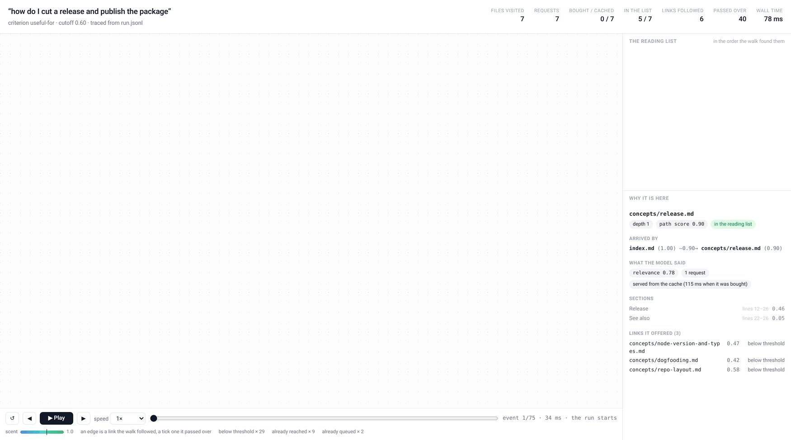

# s1m reference

Everything the [README](../README.md) leaves out: install in full, the reading list's shape,
every flag including the hidden ones, the trace and the player that draws one, the output
formats, the relevance criteria, what is sent about each link, `.s1mignore`, the cache, the
evaluation harness, the library and the development commands.

## What it is built on

**Status: milestones 2, 3 and 4.** The CLI walks a real wiki: `s1m "<query>" <entry>...`
returns the plan's reading list as JSON — every result carrying the line ranges worth reading —
with the plan's flags, defaults and exit codes, and `--mode` / `--criteria` pick what relevance
means. What it builds on is in place too — the parser from
[#4](https://github.com/mikekelly/s1m/issues/4) (`s1m::parse` turns one markdown file into its
title, frontmatter, heading sections with line ranges, and outgoing links), the Jev judgment
from [#5](https://github.com/mikekelly/s1m/issues/5) (`s1m::jev` scores one file per request,
returning a relevance score for the file, a score per heading section and a scent for each of
its links; one whose sections and links do not fit the API's state budget in one request is
split across several, and one longer than the 40,000 characters a post carries is split by its
own heading tree, so the tail the cap used to cut is judged like the rest of it), the walk from
[#6](https://github.com/mikekelly/s1m/issues/6) (`s1m::traverse` searches the link graph
best-first against an injected `s1m::scorer::Scorer`), the cache from
[#7](https://github.com/mikekelly/s1m/issues/7), which keeps those answers on disk so a repeat
run is identical and free, the three relevance criteria from
[#10](https://github.com/mikekelly/s1m/issues/10) below, and the per-section scores and line
ranges from [#9](https://github.com/mikekelly/s1m/issues/9), where a section below
`--threshold` is left out of the list. `s1m::cli` is the CLI's own half: the flags, the
walk, the reading list and the exit code, with the scorer injected so tests run it without a
key or a network. `--format` prints that reading list as the JSON [under Use](#use), as `md` — the same
list to read or paste — or as `tree`, the walk's annotated link tree
([#13](https://github.com/mikekelly/s1m/issues/13)). Milestone 3's numbers are in
[`eval/REPORT.md`](../eval/REPORT.md), which `cargo run --release --bin eval` reproduced on a
vendored wiki and reruns on any other. Milestone 4 is the packaging around all of it: `--help`,
the README and [`SKILL.md`](../SKILL.md) all lead with what s1m reads and ranks, and
`.s1mignore` keeps paths out of the scoring calls entirely
([below](#keeping-paths-out-of-it-s1mignore)). The design lives in
[docs/initial-plan.md](initial-plan.md); what the Jev calls cost and how they read on
real pages is in [docs/spike-notes.md](spike-notes.md).

## Install

macOS and Linux install a prebuilt binary, with no Rust toolchain:

```bash
curl -LsSf https://github.com/mikekelly/s1m/releases/latest/download/s1m-installer.sh | sh
```

`latest` selects a *release*, and the installer that release carries is pinned to it: it fetches
its archive from `releases/download/v0.1.0`, never from `latest`, so what you install cannot
drift underneath you. In order, the installer

| | |
| --- | --- |
| detects the platform | `uname` decides which of the [four targets](#the-archives-directly) this is, and a glibc older than the one the archive was built against is refused too |
| downloads | `s1m-<target>.tar.xz` from the release the installer came from |
| verifies | compares the archive against the SHA-256 baked into the script, and stops with `checksum mismatch` and exit 1 if the bytes are not those bytes |
| installs | `s1m` into `$XDG_BIN_HOME`, or into `~/.local/bin` when that variable is unset |

Both directories are the user's own, so `sudo` is never needed and nothing outside `$HOME` is
touched. `$S1M_INSTALL_DIR` overrides the choice, and `S1M_NO_MODIFY_PATH=1` leaves your shell
profiles alone; `s1m-installer.sh --help` lists the flags the script also takes.

Then it puts that directory on your `PATH`: it writes `$XDG_CONFIG_HOME/s1m/env.sh` — a script
that prepends the directory when `$PATH` is missing it — and adds `. "$HOME/.config/s1m/env.sh"`
to `.profile` and to whichever of `.bashrc`, `.bash_profile`, `.bash_login`, `.zshrc`, `.zshenv`
exist, plus `~/.config/fish/conf.d/s1m.env.fish` for fish. When those files are only read at the
next login it prints the one `source` line to run now, which is the whole of what a fresh shell
needs: `s1m --version` answers `s1m 0.1.0` in it.

Pin the version by fetching that release's installer instead of `latest`'s:

```bash
curl -LsSf https://github.com/mikekelly/s1m/releases/download/v0.1.0/s1m-installer.sh | sh
```

A platform the release does not carry is refused before anything is downloaded, with exit 1 and
the platform it detected:

```text
$ sh s1m-installer.sh
ERROR: there isn't a download for your platform x86_64-unknown-freebsd
```

Windows is not supported, and neither is any Linux the archives were not built for. The two
Linux archives are built on Ubuntu 22.04 runners, so a Linux whose glibc is older than 2.35 is
refused the same way: `System glibc version … is too old`, and then the message above.

### The archives directly

Every release also carries the archives and their checksums, for anyone who would rather not put
a script through their shell: `s1m-<target>.tar.xz`, a `.sha256` beside each one, and
`sha256.sum` over all of them for `sha256sum -c`.

| Asset | Runs on |
| --- | --- |
| `s1m-aarch64-apple-darwin.tar.xz` | macOS, Apple silicon |
| `s1m-x86_64-apple-darwin.tar.xz` | macOS, Intel |
| `s1m-aarch64-unknown-linux-gnu.tar.xz` | Linux, arm64 |
| `s1m-x86_64-unknown-linux-gnu.tar.xz` | Linux, x86-64 |

Each archive is a directory named for its target, holding `s1m`, the `LICENSE` and the `README`.

### From source

Stable Rust, edition 2024 — rustc 1.85 or newer — is the only requirement. The crate is not
published to crates.io or anywhere else, so `cargo install --git` is the source install. From a
checkout, `cargo build --release` leaves the binary at `target/release/s1m`, which is what the
rest of this README spells `s1m`: run `./target/release/s1m` there, or `cargo install --path .`
to put it on your `PATH`. Either way the binary is one command, and the scoring calls need a key
from your TypeSafe account — the variable is the only thing s1m reads it from:

```bash
export TYPESAFE_API_KEY=...     # see .env.example
s1m "how do I cut a release and publish the package" wiki/index.md
```

## Use

```bash
S1M_CACHE_DIR=eval/cache s1m "how do I cut a release and publish the package" \
  eval/wikis/llm-wiki-manager/wiki/index.md
```

A query and one or more entry files. The reading list goes to stdout as JSON: the query, the
criterion the answers were judged against, how many files were visited and how many calls that
cost, then `results` — the files that earned a place, most relevant first and ties broken by
path — and `walked`, the files the walk visited without earning one. Each result carries the
relevance the model gave it, the scent of the link that reached it, the path that got there,
the ranges worth reading, and its outgoing links as they were judged — `followed` says whether
a link queued its target, and a link that queued nothing carries the `reason` the walk read it
by: `below-threshold`, `not-kept`, `unjudged`, `out-of-root`, `past-depth`, `already-reached`
or `already-queued`, so no caller has to infer why from the scent and the rest of the list.
`already-reached` says the target is a file the list holds; `already-queued` says another path
had already queued it at a score at least as good, and that path the beam or the file budget
can still drop, so the target may be no page of the list. `scent` is
`null` and `via` is empty for an entry file, which no link reached; a file a link reached
carries the scent of that link and the `via` path it came along. A link whose target resolves
outside `--root` is never followed, whatever its scent.

A file earns a place on its own: relevance at or above `--threshold`, or at least one section
at or above it. A hub is worth walking through and not worth reading, so the entry pages,
section indexes and near-misses the walk only passed through are reported under `walked`
instead — the same file without `sections`: the path that reached it and the links it offered,
which is what keeps the walk explainable without handing the caller pages not to read. The two
lists together are every file the walk visited, which is what `visited` counts.

`sections` is what to open: one entry per heading section of the file that the model called
useful, each with the heading, the `[first, last]` lines to read and the score, most useful
first. The ranges are the parser's, so the lines named are the text that was scored. A section
below `--threshold` is left out: a section is one yes-or-no question to the model, and a Noul
near 0.5 means it was unsure, so the default leaves those out. Nothing is derived from the
scores — a range is never narrowed or widened — and because a section's range contains its
subsections', a parent that is a mix of useful and useless text lands near the middle and is
dropped while the subsection that mattered stays. A caller that has read one returned range has
read everything returned inside it. A result whose sections all fell below `--threshold`, and
which is in the list on its relevance alone, carries `"sections": []` in the JSON — it was
scored, and nothing cleared the bar — and the `md` view says the same in words.

Every path is spelled the way the entry files were given: `--root wiki` with `wiki/index.md`
gives `wiki/payments/cutoffs.md`, not `payments/cutoffs.md`, and those are the paths a caller
hands back to its editor. An absolute `--root` gives absolute paths.

This is a real run: the command above with `S1M_CACHE_DIR=eval/cache` pointing at the committed
[`eval/cache`](../eval/cache), which is why it reports `"calls": 0` — a cold run of the same query
buys one answer per file. The first result is in full and the rest is elided:

```json
{
  "query": "how do I cut a release and publish the package",
  "mode": "useful-for",
  "scorer": "noul",
  "visited": 7,
  "calls": 0,
  "results": [
    {
      "path": "eval/wikis/llm-wiki-manager/wiki/concepts/release.md",
      "relevance": 0.7799999999999999,
      "scent": 0.9,
      "via": ["eval/wikis/llm-wiki-manager/wiki/index.md"],
      "sections": [],
      "links": [
        {
          "target": "eval/wikis/llm-wiki-manager/wiki/concepts/node-version-and-types.md",
          "scent": 0.47,
          "followed": false,
          "reason": "below-threshold"
        },
        {
          "target": "eval/wikis/llm-wiki-manager/wiki/concepts/dogfooding.md",
          "scent": 0.42,
          "followed": false,
          "reason": "below-threshold"
        },
        {
          "target": "eval/wikis/llm-wiki-manager/wiki/concepts/repo-layout.md",
          "scent": 0.58,
          "followed": false,
          "reason": "below-threshold"
        }
      ]
    },
    … (the entry page, `repo-layout.md`, `dogfooding.md` and `e2e-tests.md`, the rest of the list)
  ],
  "walked": [
    {
      "path": "eval/wikis/llm-wiki-manager/wiki/concepts/node-version-and-types.md",
      "relevance": 0.5533333333333333,
      "scent": 0.7,
      "via": ["eval/wikis/llm-wiki-manager/wiki/index.md"],
      "links": [
        {
          "target": "eval/wikis/llm-wiki-manager/wiki/concepts/repo-layout.md",
          "scent": 0.85,
          "followed": false,
          "reason": "already-reached"
        },
        … (four more links, elided)
      ]
    },
    … (`template-system.md`, elided)
  ]
}
```

The first result is the page this query is about: `concepts/release.md`, at relevance 0.78,
whose "Release" section says the runbook lives in `RELEASING.md` at the repo root and what it
covers — branching, semver, tagging, npm Trusted Publishing, the release workflow, the
post-release sync, troubleshooting and manual fallbacks. It is in the list on that relevance
alone: every section of the page came back below `--threshold`, so `sections` is empty and no
range is offered for it — the file was scored, and nothing cleared the bar. The one range this
run returns belongs to its last result: `e2e-tests.md` lines 78–83, its "CI and release"
section at 0.64, the `release:check` chain a release runs through.

The run visited seven files and returned five. `index.md`, the entry file, is a result on its
relevance of 0.74, as are `repo-layout.md` at 0.66 and `dogfooding.md` at 0.60; `e2e-tests.md`
is the last of them because its section cleared the threshold while its relevance of 0.44 did
not — the two halves of the rule that earns a place, in one list. The two files under `walked`
earned neither: `node-version-and-types.md` came back at relevance 0.55 with no section above
the threshold, and `template-system.md` at 0.31. Both are worth walking through — they are how
the walk reached the rest of the wiki — and neither is worth reading for this query, so they
carry the path that reached them and the links they judged, and no ranges. Both lists are
elided for length: the run returns five results and reports two files under `walked`.

| Flag | Default | Meaning |
| --- | --- | --- |
| `--mode` | `useful-for` | What relevance means: `about`, `useful-for` or `answers` |
| `--criteria` | none | A file whose content is the criterion, in place of `--mode` |
| `--max-files` | 25 | Files the walk judges beyond the entry files, which are always visited and free. The eval shows the threshold binding first on a wiki this size: 25 returns the same mean recall as 10 over two more files, and a bigger corpus is unmeasured ([numbers](../eval/REPORT.md#results-at-a-fixed-file-budget)) |
| `--max-depth` | 6 | Link hops from an entry file |
| `--threshold` | 0.6 | Least link scent that queues a target, least relevance or section score that earns a file a place in the list, 0 to 1. The knee of the eval's sweep: 0.5 lifts mean recall from 0.83 to 0.88 for half again the reading, 0.7 drops it to 0.67 for 40% less ([numbers](../eval/REPORT.md#the-default-threshold)) |
| `--root` | the first entry file's directory | Bounds the walk: a link resolving outside it is not followed |
| `--no-cache` | off | Call Jev for every file, ignoring the answers on disk |
| `--format` | `json` | `json` (the list above), `md` (what to read: the results, with the lines worth reading) or `tree` (the walk's link tree, `walked` files included) |

The `--threshold` and `--max-files` defaults are backed by numbers in
[eval/REPORT.md](../eval/REPORT.md), and the decisions are recorded in
[docs/initial-plan.md](initial-plan.md#defaults-from-the-evaluation).
A second harness, [`eval/agent/README.md`](../eval/agent/README.md), measures the
same reading list against a Claude Code Explore agent on the same queries — on
any wiki, with nothing about it committed.

### Hidden flags

These are behind `--help`'s back: the experiments the issues track, not the interface. The
defaults above are what ships, and a run that names none of these flags is the walk the numbers
above describe.

| Flag | Default | Meaning |
| --- | --- | --- |
| `--no-preview-headings` | off | Leave each link target's own H2/H3 headings out of its preview, the way the state was before [#46](https://github.com/mikekelly/s1m/issues/46) |
| `--no-preview-leads` | off | Leave the anchor text of each link target's own in-root links out of its preview: the same ablation |
| `--one-hop-links` | off | Ask the link question about one hop rather than two, the way it was asked before [#46](https://github.com/mikekelly/s1m/issues/46) |
| `--scorer` | `noul` | How a file's links are judged. `noul` is one question per link — is following this likely to lead somewhere useful — and `choice` is one question over the page: which of these links is the best next step, answered as a share per link. The reading list reports which one it was as `scorer`, because a link's `scent` is not the same kind of number under the two ([#47](https://github.com/mikekelly/s1m/issues/47)) |
| `--previews` | off | Under `--scorer choice`, describe each option with its target's preview as the state carries it, the ablation flags included. Off, an option is the page's own words about the link — its anchor, its sentence and its heading. The file's own Score and its sections are judged with the state that ships either way, so the comparison is between link judgments |
| `--share-floor` | `0.02` | Under `--scorer choice`, least share of a page's Choice that keeps a link |
| `--share-k` | `3` | And the cut's numerator: a link has to hold `k / options` of the page's probability |
| `--beam` | `8` under `--scorer choice`, none otherwise | Files the walk visits at one depth |
| `--wording` | the wording that ships | Ask the three questions in another register, leaving the criterion alone: `navigator`, `path`, `sharp-no`, `rules`, `necessity`, `section-legacy`, `reader-action`, `answer-bearing` or `reader`. It composes with `--mode` rather than replacing it — one picks what counts as relevant, the other how the questions about it are put — and the reading list still reports the criterion's name ([#52](https://github.com/mikekelly/s1m/issues/52)) |
| `--trace` | off | Write the walk to a file as it happens, one JSON object per line, so it can be replayed ([the trace of a run](#the-trace-of-a-run)) |

A Choice over a page keeps a link when its share clears
`max(--share-floor, min(--share-k / options, 0.5))`, where `options` counts the `none` option
every Choice carries — and never keeps one when the page's best option is `none`, and always
keeps the one link the model put above it. The `0.5` ceiling is what keeps a small page
followable: without it `k / options` would be one or more on a page of three options or fewer,
and no answer could clear it. `--beam` is the budget of a beam search, of the same kind as
`--max-files` one depth at a time: a path the walk has no turn for is dropped rather than
expanded.

The measurement behind them is in [docs/spike-notes.md](spike-notes.md#the-relative-judge-one-choice-over-a-pages-links),
and the table is in [eval/REPORT.md](../eval/REPORT.md#the-relative-judge-one-choice-over-a-pages-links).
Its rows are bought rather than free, so `eval` measures them when it is asked to —
`cargo run --release --bin eval -- --relative-judge` beside its usual arguments — and the
committed cache answers them for a rerun like any other.

`--wording` is the same kind of thing for the questions themselves: it puts the file's Score,
each section's Noul and each link's Noul into one of nine registers without touching the
criterion they are asked under, so a row of the wording table is the walk that ships with
different words in it. The sentences each name sends are in `Wording` in
[`src/jev.rs`](../src/jev.rs), sentence for sentence, held there by a test. All nine were measured
on the public gold set and again on a private wiki
([#52](https://github.com/mikekelly/s1m/issues/52)), and one of them changed what ships: the
section question is now `task`'s — a section earns its place by holding something the reader
would use — which held recall exactly on both sets for a third less reading. `reader-action` met
the private rule and lost recall on the public set, so it stays a register; every link register
was below the question that ships. The register that puts the old section question back is
`section-legacy`, so a walk from before the decision is still repeatable request for request. The
eval measures the registers when asked — `cargo run --release --bin eval -- --wordings` — with
the table in
[eval/REPORT.md](../eval/REPORT.md#the-wording-the-same-three-questions-in-another-register) and the
decision in
[docs/spike-notes.md](spike-notes.md#the-wording-what-the-three-judgments-are-asked-in).

### The trace of a run

`--trace FILE` writes what the walk did to `FILE` as it does it: one JSON object per line, each
with `t_ms`, the milliseconds since the walk started. Off is off — no record is built at all —
and on is a record of the run rather than an input to it: the reading list on stdout is the one
the same command prints without the flag, and it is the same cache key, so a traced run and an
untraced one ask for the same things and rank the same files.

What it is for is replay. A reading list says what the walk found; a trace says what it did, in
the order it did it, so a run can be drawn as the crawl it was with the list filling in. Each
line is written whole and as its event happens, so a run that is killed leaves everything up to
the kill — a reader that stops at the last line has a trace of the run so far, and never half a
line.

Paths are relative to the root the walk is bounded by — `notes/ledger.md` for a root of `wiki` —
which is how `via` and a link's target are spelled within a run.

| `event` | Fields | What it is |
| --- | --- | --- |
| `started` | `query`, `mode`, `threshold` | The run the walk was for, written before the first file is read: the query as the request carried it, the criterion the reading list reports — a mode's name, or the `--criteria` file's path — and the cutoff the walk ran under. The one thing a replay cannot derive from the rest, since a reading list is printed and not stored ([#73](https://github.com/mikekelly/s1m/issues/73)). A trace from before this record existed has none, and plays without it. |
| `popped` | `path`, `path_score`, `depth`, `via` | The walk took the file off the frontier. The entry files come first, at path score 1, depth 0 and no `via`; every other path carries the score, depth and `via` of the best path found to the file. |
| `requested` | `path`, `post_index` | One request for the file, once per post: a page whose sections and links do not fit one request is asked about in several, and each is a record of its own, in the order they were sent. |
| `answered` | `path`, `latency_ms`, `relevance`, `cached`, `sections`, `links` | The scorer's answer: the file's relevance, a score per heading section and a scent per link, each as the scorer gave it. `cached` is `true` when the answer came off the disk, and `latency_ms` is what the call that bought it took — whenever that was, so a warm replay can be told from a cold one. |
| `admitted` | `source`, `target`, `scent` | A link queued its target, at `scent` of the source's path score. |
| `pruned` | `source`, `target`, `scent`, `reason` | Either a link that queued nothing — `below-threshold`, `not-kept`, `unjudged`, `out-of-root`, `past-depth`, `already-reached`, `already-queued`, `ignored` — or a path the walk queued and then dropped: `beam`, `max-files`. The same reasons a reading list spells out on a link ([#50](https://github.com/mikekelly/s1m/issues/50)) |
| `result` | `path`, `relevance`, `earned_a_place` | The file was visited, with the reading list's own verdict on it: relevance or a section at or above `--threshold`. |

A path can be admitted and pruned later, by `beam` or by `max_files`: both budgets are read when
the walk takes a path off the frontier and not when a link queues it, so a replay has both
records and knows the path never became a visit. A path can also be popped more than once — a
round's own answers can overtake a file it popped, and the walk puts it back on the frontier with
the answer it already bought — in which case its `requested` and `answered` come with the first
pop and its `result` with the last. A file the walk could not judge keeps what happened to it: a
`popped`, and a `requested` when it reached the scorer. A page that could not be read never
reached it, so its trace is the pop alone, and no `answered` is written for either.

```bash
s1m --trace run.jsonl "how do I cut a release and publish the package" \
  eval/wikis/llm-wiki-manager/wiki/index.md
jq -c 'select(.event == "admitted" or .event == "result")' run.jsonl | head -3
```

The trace is not part of the walk's determinism, and does not have to be: `t_ms` and `latency_ms`
are the run's real timings, and the order a round's answers come back in is the network's. What
the reading list promises — the files visited and the order they rank in — is the same with the
flag as without it. What draws one is [`s1m play`](#playing-a-trace), which is
[#73](https://github.com/mikekelly/s1m/issues/73) on top of this.

### Playing a trace

`s1m play run.jsonl` turns a trace back into the run it was: one HTML page beside the trace, with
the player and the records inside it. Nothing is fetched — no server, no stylesheet, no image
next to it — so it opens from the disk with the network unplugged, `--out FILE` puts it
somewhere else, and `--out -` writes it to stdout.

```bash
S1M_CACHE_DIR=eval/cache s1m --trace run.jsonl \
  "how do I cut a release and publish the package" \
  eval/wikis/llm-wiki-manager/wiki/index.md
s1m play run.jsonl
```



The recording above is that page playing the same trace, stepped an event at a time.

The page is the walk in the order it happened. A file appears when the walk pops it — dashed while
it waits on the frontier, dropped when a budget took it first — and carries its relevance, its
depth and the sections the model scored, green where a section cleared `--threshold`. A link the
walk followed is an edge, coloured and thickened by the scent it was followed at; the links it
passed over are the marks along each file's bottom edge, coloured the same way and counted under
the canvas by reason, which is what makes the passed-over half of a run visible rather than
implied.

Play, step and the scrubber move the run along by event rather than by wall clock — a warm run's
whole trace spans about 20 ms, so equal time per event is the only way to watch one — and the
clock shows the real `t_ms` of whatever is on screen all the same. The speed control runs from
0.125× to 16×, where 1× is 85 ms an event and 0.25× — the pace a page opens at — is 340 ms; past
roughly 5× the run advances several events per frame, so the tempo the control promises holds even
where the picture cannot keep up.

The panel beside it is the question a reading list answers without evidence. It lists the files the
walk visited in the order it found them, marks the ones that earned a place, and says what earned
it: its relevance, or the section that cleared the cut. Selecting any file — in that list, on the
crawl, or among the links another file offered — opens its evidence: the path that reached it with
the scent of every hop, the path score it arrived at, its relevance, whether the answer was bought
or served from the cache and what the call took, each section with its line range and score, and
every link it offered with what the walk did about it — followed, or the rule that queued nothing.
A link whose target the walk never queued names a file the trace holds nothing about, and the
panel says that rather than nothing at all.

A trace holds the paths of the wiki it was made over and the query it was made for, so it and the
page drawn from it are local artifacts of the run, like an eval's `--out` directory: keep them
where the run is, and do not commit them or attach them to an issue. Rendering a page asks
nothing of the network, the cache or the API key — it reads the trace and writes one file.

### Output formats

`--format` picks the view of that reading list. `json` is the default and the one to parse;
`md` and `tree` are for a person, or for an agent that will paste the result into its own task.

`md` is the list to act on: the files that earned a place, in the same order, each with the
lines worth reading and the score that put it there, one line per section. What the walk
visited without earning a place is the JSON's `walked` and `tree`'s, not `md`'s — a hub is
walked through, not read — and both views still say how many files were visited.

```bash
S1M_CACHE_DIR=eval/cache s1m --format md "how do I cut a release and publish the package" \
  eval/wikis/llm-wiki-manager/wiki/index.md
```

```markdown
# Reading list: how do I cut a release and publish the package

Criterion: useful-for; 7 files visited, 0 calls

## 1. `eval/wikis/llm-wiki-manager/wiki/concepts/release.md`

relevance 0.78; scent 0.90; via `eval/wikis/llm-wiki-manager/wiki/index.md`

- nothing above --threshold

## 2. `eval/wikis/llm-wiki-manager/wiki/index.md`

relevance 0.74; entry file

- nothing above --threshold

## 3. `eval/wikis/llm-wiki-manager/wiki/concepts/repo-layout.md`

relevance 0.66; scent 0.78; via `eval/wikis/llm-wiki-manager/wiki/index.md`

- nothing above --threshold

## 4. `eval/wikis/llm-wiki-manager/wiki/concepts/dogfooding.md`

relevance 0.60; scent 0.82; via `eval/wikis/llm-wiki-manager/wiki/index.md`

- nothing above --threshold

## 5. `eval/wikis/llm-wiki-manager/wiki/concepts/e2e-tests.md`

relevance 0.44; scent 0.64; via `eval/wikis/llm-wiki-manager/wiki/index.md`

- lines 78-83, score 0.64, CI and release
```

This is that query from the cache, so it reports no calls and its digits are the stored answers;
`md` is the same reading list either way. It prints the five files the JSON returns and none of
the two it walked: `node-version-and-types.md` and `template-system.md` earned no place, so they
are not something to paste into a task, and the header still says how many files the walk
visited. A result whose sections all fell below `--threshold` says so in place of a section line
— four of the five above — and a section with no heading of its own, the text before a file's
first heading, reads `(preamble)` where the heading would be.

`tree` is the walk as it happened: every file it visited — the `results` and the `walked` alike
— and beneath each one every link the model judged, in the order the frontier would have taken
them, highest scent first, ties broken by path. Each link line carries the scent it was given
and what the walk did about it, in one of three marks:

| Mark | The link |
| --- | --- |
| `followed` | queued its target — and the target is a line under it when the walk went on to visit it, which a beam or the file budget can stop |
| `already reached` | points at a file the walk already had — an entry file, or a page another link reached first — so the link queued nothing and the page is a line of the tree elsewhere |
| `pruned` | queued nothing for anything else: a scent below `--threshold`, a share the scorer did not keep, a link the model named no scent for, a target outside `--root`, one past `--max-depth`, or a target another path had already queued at a score at least as good |

Only the middle one says the page is in the walk's hands. The JSON's `reason` tells the `pruned`
ones apart — `below-threshold`, `not-kept`, `unjudged`, `out-of-root`, `past-depth`,
`already-queued` — and an `already-queued` target is the one page that may never be reached at
all: the path that held it is dropped if a beam or the file budget runs out. Before
[#50](https://github.com/mikekelly/s1m/issues/50) every one of these printed `pruned`, which is
what misled two analyses of runs like the one below. A `followed` link with no line under it is
the other half of the same thing: the target was queued, and the walk stopped before its turn.

```bash
S1M_CACHE_DIR=eval/cache s1m --format tree "how do I cut a release and publish the package" \
  eval/wikis/llm-wiki-manager/wiki/index.md
```

```text
how do I cut a release and publish the package (useful-for); 7 files visited, 0 calls

eval/wikis/llm-wiki-manager/wiki/index.md  entry file; relevance 0.74
  eval/wikis/llm-wiki-manager/wiki/concepts/release.md  followed; scent 0.90; relevance 0.78
    eval/wikis/llm-wiki-manager/wiki/concepts/repo-layout.md  pruned; scent 0.58
    eval/wikis/llm-wiki-manager/wiki/concepts/node-version-and-types.md  pruned; scent 0.47
    eval/wikis/llm-wiki-manager/wiki/concepts/dogfooding.md  pruned; scent 0.42
  eval/wikis/llm-wiki-manager/wiki/concepts/dogfooding.md  followed; scent 0.82; relevance 0.60
    eval/wikis/llm-wiki-manager/wiki/concepts/release.md  already reached; scent 0.92
    eval/wikis/llm-wiki-manager/wiki/concepts/repo-layout.md  pruned; scent 0.80
    ...
  eval/wikis/llm-wiki-manager/wiki/concepts/repo-layout.md  followed; scent 0.78; relevance 0.66
    eval/wikis/llm-wiki-manager/wiki/concepts/release.md  already reached; scent 0.93
    eval/wikis/llm-wiki-manager/wiki/concepts/dogfooding.md  already reached; scent 0.77
    eval/wikis/llm-wiki-manager/wiki/concepts/template-system.md  followed; scent 0.72; relevance 0.31
      eval/wikis/llm-wiki-manager/wiki/concepts/repo-layout.md  already reached; scent 0.86
      ...
    ...
  eval/wikis/llm-wiki-manager/wiki/concepts/node-version-and-types.md  followed; scent 0.70; relevance 0.55
    eval/wikis/llm-wiki-manager/wiki/concepts/release.md  already reached; scent 0.92
    ...
  eval/wikis/llm-wiki-manager/wiki/concepts/e2e-tests.md  followed; scent 0.64; relevance 0.44
    eval/wikis/llm-wiki-manager/wiki/concepts/dogfooding.md  already reached; scent 0.76
    eval/wikis/llm-wiki-manager/wiki/concepts/unit-tests.md  pruned; scent 0.54
    eval/wikis/llm-wiki-manager/wiki/entities/commands.md  pruned; scent 0.40
    eval/wikis/llm-wiki-manager/wiki/concepts/init-command.md  pruned; scent 0.31
  ...
```

The `...` lines are links the walk passed over, elided here; the run prints every one of them.
The tree is where the walk's own answers show. `release.md` is the best page in the list and the
entry follows the link at 0.90; `dogfooding.md`'s stronger-looking link to it, at 0.92, says
`already reached`, because the file had already been reached and a file is visited once, along
the best path found to it. The lines marked `pruned` are links the model scored below
`--threshold`, which is why seven files are where the walk spent its calls. A tree with more files
on it than the list has is the cutoff at work: `node-version-and-types.md` at 0.55 and
`template-system.md` at 0.31 are walked rather than returned, and they are here because the
links under them are how the walk reached the rest of the wiki. Roots are the files no link
reached: the entry files the caller named, marked `entry file`. A link whose target the model
never judged prints `scent unknown` — such a link can never be followed, and a 0.00 would read
as a judgment when none was made.

Both views round scores to two decimals, because they are for reading: `json` is where the
model's own number lives. Both are rendered from the reading list alone — `md` from `results`,
`tree` from `results` and `walked` — so either can be printed from any list a caller has,
including one it assembled itself, and neither can disagree with the JSON about a file, a range
or a link.

### Relevance modes

The query goes into the request exactly as it was asked; the mode picks what the model is told
to judge it by. Three are built in, and `--mode` chooses one:

| Mode | The criterion the model judges by | Typical use |
| --- | --- | --- |
| `about` | Is the content on the subject of the query | Browsing, collecting everything on a subject |
| `useful-for` (default) | Would the content help someone doing what the query describes | Agents with a task |
| `answers` | Does the content contain the answer to the query | Question lookup |

Each mode sends its own three questions: one Score for the file as a whole on a four-level
ladder, one Noul per heading section, and one Noul per outgoing link. The section question is
the one every mode shares since [#52](https://github.com/mikekelly/s1m/issues/52) measured it
better than the question each mode used to ask — does the section hold something the reader would
use: a step, a rule, a value, a decision — and the wording it replaced is still reachable as
`--wording section-legacy`. The reading list reports which criterion judged the answers, so a
store of results can say what they are relevant to:

```bash
s1m --mode answers "how long does an instant payout take to settle" wiki/index.md
```

The criterion is part of the cached request, so switching mode over the same files buys fresh
answers rather than reading the previous mode's.

### Custom criteria

`--criteria FILE` replaces the mode with a criterion of your own. The file is plain text, and
its whole content, trimmed, is the criterion — the sentence a mode would otherwise supply:

```text
The content states the cut-off that decides whether an instant payout can still be sent.
```

s1m puts that sentence into all three questions and scores the file on a criterion-independent
four-level ladder (unrelated, tangential, supporting, central), because a built-in ladder is
written for its own criterion. `--criteria` overrides `--mode` rather than conflicting with it,
and the reading list reports the file's path as `mode`, so a caller can tell which criterion
judged the answers:

```bash
s1m --criteria criteria/payout-cutoffs.md "when is it too late to send" wiki/index.md
```

A criteria file that cannot be read, or that holds nothing, exits 2 naming it, before anything
is bought.

### What is sent about each link

Every request carries, per outgoing link, its anchor, the sentence around it and its enclosing
heading, and a preview of the target read from disk:

| Part of the preview | What it is |
| --- | --- |
| `title`, `first_paragraph` | The target's title and its opening paragraph, each cut at 600 characters |
| `frontmatter` | Its frontmatter fields, whole and in the page's own order, up to 1,200 characters |
| `headings` | Its own H2 and H3 headings, in order, up to 40 of them and each cut at 80 characters |
| `leads_to` | The anchor text of its own in-root links, in order, deduped, up to 30 and each cut at 60 characters |

`headings` and `leads_to` are one hop of lookahead past the target, and they are there because a
link's own sentence and the target's opening line do not always say what sits under the page: a
hub links to "Payments" whose first paragraph is about payments, while the query's answer is in
the section called "Cutoffs". The link question is asked about what the link reaches *directly or
through the pages it links to*, which is the same idea put to the model. Together they are worth
0.24 of mean recall on the eval's gold set (0.59 → 0.83) for 2.4× the input tokens
([#46](https://github.com/mikekelly/s1m/issues/46), [eval/REPORT.md](../eval/REPORT.md#the-link-context-what-the-state-carries-and-what-each-part-earns));
each part's own contribution is the ablation table there, and each has a hidden flag that leaves
it out (`--no-preview-headings`, `--no-preview-leads`, `--one-hop-links`).

Previews are always on for a query — the spike measured them as the signal that separates a page
which says nothing from one whose own links point at the answer, at roughly 250 input tokens a
link, and a threshold tuned with previews is not valid without them
([docs/spike-notes.md](spike-notes.md)) — so this is part of the request rather than a
caller's flag. `s1m score-file --no-previews` stays as the spike's control case. The frontmatter
is the part of a preview most likely to mislead, and the eval put a number on it: dropping the
frontmatter costs 0.07 of mean recall (0.83 → 0.77) for a third of the input tokens saved, and
dropping previews altogether costs 0.48, so the frontmatter is the larger half of what a preview
buys — `related:` is why ([eval/REPORT.md](../eval/REPORT.md#the-preview-experiment-frontmatter)).

Every part of a preview is bounded, because a preview is a hint about a target and the target is
a page this walk did not choose — one page's frontmatter would otherwise be added whole to the
state of every page that links to it ([#37](https://github.com/mikekelly/s1m/issues/37)): the
first paragraph is cut at 600 characters, the title at 600, and the frontmatter at 1,200
characters of whole fields in the target's own order. The largest frontmatter block on either
vendored wiki is 653 characters of text, which that cap counts as 562, so no measured page is
cut by any of those bounds. A page whose state does not fit the API's budget is split across
requests rather than trimmed further, so what the bounds buy is a hint that stays a hint, not a
link that goes unjudged.

### Keeping paths out of it: `.s1mignore`

A wiki that holds anything private needs to say so, because this is a run that sends what it
visits to a third party. Put a `.s1mignore` beside the pages, in the root the walk is bounded
by, and its lines are [gitignore patterns](https://git-scm.com/docs/gitignore) — the matcher is
the `ignore` crate's, the one ripgrep uses, and s1m walks a path's levels from the root down the
way git does, so the syntax and the semantics are git's and not an approximation of them:

```text
# Nothing under private/ leaves this machine.
private/

# Every key, except the one that is meant to be shared.
*.key.md
!public.key.md
```

A `!` line re-includes what a broader line took, at the level it is written for. It cannot reach
inside a directory an earlier line excluded — `private/` excludes `private/readme.md` however
loudly a later line asks for it — because git does not look inside an excluded directory either,
and neither does s1m.

A matched path is never read, on the way in and on the way out:

| Where | What happens |
| --- | --- |
| A link whose target matches | The link is out of the file before it is judged: no question is asked about it, its target is not opened for a [preview](#what-is-sent-about-each-link), its path is not among the request's links, and the walk does not queue it whatever the model would have scored it. The reading list reports no such link — not as pruned, but not at all |
| An entry file you name | Exit 2 with the path, the `.s1mignore` and one line on stderr, before anything is read or bought. Naming a path is asking for it, so silence would be the wrong answer |
| The `.s1mignore` itself | A file that cannot be read, that holds a pattern that does not parse, or that is there but is not a readable file — a directory, a symlink whose target has gone — is exit 2. Dropping a rule quietly would send exactly the files the rule was written for |

What is *not* removed is another page's prose about a matched one: a page you do link to still
says "see the vault" in its own words, and the words of a page the walk reads are what is sent.
The rules cover the target — its text, its path as a link to judge, its preview — not the
sentences other authors wrote around it.

Three consequences worth knowing:

- Only the root's `.s1mignore` is read. One in a subdirectory is not: what a wiki excludes is
  stated in one place, and `--root` is what decides which file that is.
- The rules are part of what a request is. A page judged with the file visible and the same page
  judged with it ignored are different questions, so the [cache](#cache) keys them apart and
  narrowing `.s1mignore` never serves an answer bought while the file was readable.
- `s1m score-file` runs under the same rules, and so does everything driven from the library —
  the [evaluation harness](#evaluation) included: `s1m::ignore::Ignore` is one value a run is
  built around, not a filter over its output.

Exit codes:

| Code | Meaning |
| --- | --- |
| 0 | The walk reached files beyond the entry files that earned a place |
| 1 | Nothing beyond the entry files did: `results` is the entry files alone, or empty with the walk under `walked`. Either the model judged the entry files' links and none passed the threshold, or everything the walk reached was a hub — its relevance and every section below `--threshold` — or the page a link did reach could not be judged. The JSON is still on stdout, and one line on stderr says so |
| 2 | Error: bad flags, an unknown `--mode`, a blank query, no entry file, an entry file that cannot be read, an entry file the root's `.s1mignore` covers, a `.s1mignore` that cannot be read or parsed, a criteria file that cannot be read or holds nothing, a missing `TYPESAFE_API_KEY`, or a run that judged nothing at all. One line on stderr, nothing on stdout — a mistyped flag is the exception, where the usage message is what tells the caller what the flags are |

A file the walk *reached* but could not read is neither an error nor a silent omission: a link
to a page that is not there is the wiki's business, so it is named on stderr as skipped and the
walk carries on. A page that *is* there but whose judgment failed is the same case: the API
refusing one page — a state over its budget, a page whose text will not decode — is the wiki's
business too, so that page is named on stderr as skipped, its links are not followed, and the
walk keeps what it judged ([#37](https://github.com/mikekelly/s1m/issues/37)). A page that was
judged and earned no place is not an error either: it is under `walked`, with the links it
offered. Only a run that judged nothing at all — an entry file whose judgment failed with no
other page reached — is exit 2, because there is no list to print.

### Environment

| Variable | Meaning |
| --- | --- |
| `TYPESAFE_API_KEY` | Required. The key the scoring calls are made with; without it s1m exits 2 saying so |
| `S1M_CACHE_DIR` | Where stored answers live, else `$XDG_CACHE_HOME/s1m`, else `~/.cache/s1m` |
| `S1M_ENDPOINT` | Ask this endpoint instead of `https://api.typesafe.ai/v1/systemone` — a proxy, or a test's fake server. It is part of the cache key, so one endpoint's answers are never served for another's |

### Debug view of one file

`s1m score-file <query> <file>` is hidden, and it is the spike's debug view rather than the
interface. It parses one file, sends one Jev request, and prints the file's relevance, the
call's model, question count, how many requests those took, tokens, latency and cost, then one
row per section and one per link, best score first.

```bash
s1m score-file "how do I cut a release and publish the package" \
  eval/wikis/llm-wiki-manager/wiki/index.md
s1m score-file --no-previews "how does s1m decide which links to follow" \
  docs/initial-plan.md
```

`--root DIR` sets the directory links resolve against (the file's own directory by default), and
`--no-previews` leaves the whole preview out of the request, which is the control case for whether
a preview earns its tokens. The hidden `--no-preview-headings`, `--no-preview-leads` and
`--one-hop-links` do the same one part at a time — the ablations the eval measures
([#46](https://github.com/mikekelly/s1m/issues/46)) — the hidden `--wording NAME` asks the three
questions in another register ([#52](https://github.com/mikekelly/s1m/issues/52)), and the root's
[`.s1mignore`](#keeping-paths-out-of-it-s1mignore) applies here too: a file it matches is an
error naming it, and a link to one is not judged at all.

Answers are cached (see [Cache](#cache)), so it also prints `cache hit`, `miss` or `off` with
the directory the entries are in, and `files` and `calls` on separate lines — one file scored,
and how many real API calls that took, which is zero on a hit. `--no-cache` calls Jev even for
a request already answered, which is what the spike's numbers come from.

## Cache

Jev is stable but not bit-for-bit deterministic: the same request sent three times returned the
same top links and moved the numbers underneath them
([docs/spike-notes.md](spike-notes.md)). Repeat runs are therefore identical — and close to
free — only because s1m keeps the answers.

That is where the reading list's `calls` comes from. It counts the judgments bought from the
API, not the files the walk visited: a cold run over three files reports `3`, the same run again
reports `0` with `visited` unchanged and the same files returned, and `--no-cache` reports a call
per file every time. A
judgment is one or more requests — a page whose sections and links did not fit one request took
several — so `calls` is what a run cost in answers, and `s1m score-file` prints the requests
behind one of them. Two runs that read the
same stored answers are byte-identical, and a warm run differs from the cold one that filled the
cache in `calls` alone. Two `--no-cache` runs of one query keep the same ranking and move the
numbers underneath it, which is the difference the cache exists to remove.

An answer is cached under a SHA-256 of the request that produced it: the endpoint, the model,
the query, the mode's questions and criteria (so a second run under `--mode` or `--criteria` is
a different question and is bought), the file's path, title and content, each section's heading,
depth and lines, and each link's target, anchor, sentence, heading and preview. Change any of
those and it is a different question; a second identical run makes no API call at all. An entry
is one file's judgment, and what that judgment cost when it was bought — the model, the request
count, the tokens and the latency — so a run whose answers all came off the disk can still say
what they cost, which is what [`eval/REPORT.md`](../eval/REPORT.md) does. The
thresholds are the caller's, applied to the answers, so changing `--threshold` between runs
buys nothing.

The model in that key is the alias the request asks for — `jev-latest` — not the version that
answered it, which is only known once the call has come back. An entry therefore keeps the
answer the alias gave when it was written: when TypeSafe moves the alias to a new model, delete
the directory or run with `--no-cache` to see the new numbers.

Entries are JSON files under `$S1M_CACHE_DIR` if that is set, else `$XDG_CACHE_HOME/s1m`, else
`~/.cache/s1m`. `--no-cache` skips the cache and calls Jev every time. An entry that cannot be
read — truncated by a full disk, edited by hand, written by an older s1m — is a miss, never a
wrong answer, and an entry that cannot be written costs nothing but the recomputed call; s1m
only fails, at startup and with the path, when the cache directory itself cannot be created.

Nothing evicts entries yet, and nothing needs to: an entry is a relevance, a range and a score
per section and a scent per link, so a few kilobytes for a link-heavy page and a few tens of
megabytes for a few thousand of them. Delete the directory to reclaim the space, or point
`S1M_CACHE_DIR` at a scratch directory per run.

## Evaluation

What the ranking is worth, measured rather than asserted: [`eval/REPORT.md`](../eval/REPORT.md) is
what s1m found and what it cost over 20 labelled queries on the vendored
[`llm-wiki-manager`](../eval/wikis/llm-wiki-manager/SOURCE.md) vault, with the gold set in
[`eval/gold/llm-wiki-manager.json`](../eval/gold/llm-wiki-manager.json).

```bash
cargo run --release --bin eval -- \
  --wiki eval/wikis/llm-wiki-manager/wiki \
  --gold eval/gold/llm-wiki-manager.json \
  --cache eval/cache \
  --out eval/REPORT.md
```

The harness walks each query at `--max-files` 10 and 25 and reports, per query and in total:
recall and precision against the gold set — the list holds only the files that earn a place, so
precision is reported over that list and over everything the walk judged — the same question one
level down, **section recall** (the labelled part of each wanted page the returned ranges cover,
beside file recall) and the lines those ranges span, the tokens an agent
would read (the returned ranges, the same files whole, and the whole corpus), what the API was
asked and what it cost, the same numbers for the keyword ranker, the calibration curve of a
link's scent against what following it reached, a `--threshold` sweep, the preview experiment
[#10](https://github.com/mikekelly/s1m/issues/10) deferred — previews off, previews without
frontmatter, previews as they ship — and the link-context ablations
[#46](https://github.com/mikekelly/s1m/issues/46): the target's headings, its lead anchors and the
two-hop link question each taken away in turn, with the requests each one took (requests per
answer is what a preview that costs more per link costs in posts).

Nothing about a wiki or a gold set is in the harness: both are paths, so the same command
measures a private wiki, and the gold set's paths are relative to `--wiki`. The report is
reproducible rather than merely repeated — a cache entry stores what its call cost, and no
number in the report is a wall clock — so with `eval/cache` committed the command above prints
the same bytes with no key at all, and `--no-cache` with a key buys every judgment again.

Its headline:

- **Recall and precision at `--max-files` 10**: mean recall 0.83, mean precision 0.27 — 32 of the
  39 wanted pages, over 126 files returned. The cutoff is what moved them: the walk judged 186
  files and the list returns the 126 that earned a place. The budget is not what binds: the walk
  runs out of links above `--threshold` first, and `--max-files 25` judges 213 files for the same
  mean recall (0.83).
- **Section recall, beside file recall**: 0.74 — 27 of the 39 wanted *parts* the gold set labels
  are covered by the returned ranges, for 3,054 lines returned. A label is the heading or line
  range an entry names, and an entry that names none is wanted whole, so its part is its page. The
  walk that shipped before [#52](https://github.com/mikekelly/s1m/issues/52) — `--wording
  section-legacy` — returns 0.78 of those parts for 4,479 lines: four points more of the wanted
  parts, for half again the reading.
- **What an agent reads**: 44,906 tokens for the returned ranges, against 120,322 for the same
  files whole and 346,160 for every page on every query. Reading the returned files whole costs
  35% of the corpus's text; the section scores take 63% off that, and the ranking 87% off reading
  everything.
- **What it costs**: $0.045945 for the gold set at `--max-files 10` — $0.002297 a query, at 0.20 s
  an answer. That is the price of the link context below: the state that shipped before
  [#46](https://github.com/mikekelly/s1m/issues/46) found 0.59 of the wanted pages for $0.018846.
  On this wiki the keyword ranker still finds more and reads far more — recall 0.94 against s1m's
  0.83, at 5.4× the tokens.

## Library

The parser and the Jev judgment later stages build on live in `src/` and are reachable without
the CLI, so they can be driven directly from tests:

| Item | What it does |
| --- | --- |
| `parse::parse(path, root)` | One file's `title`, `frontmatter`, `sections` (`heading`, `level`, `lines`) and `links` (`target` resolved against `root`, `anchor`, `sentence`, `heading`, `inRoot`) |
| `parse::preview(path, root)` | A link target's `title`, `frontmatter` and `first_paragraph`, plus its own H2/H3 `headings` and the `leads` — the anchor text of its in-root links — for link previews |
| `ignore::Ignore` | The root's `.s1mignore`: `Ignore::at(root)` reads it (a root without one matches nothing, a file that cannot be read or parsed is an error, and `Ignore::none()` is the empty set), `matched(relative_path)` answers for a path or any directory above it. One value a run is built around, asked by the CLI for its entry files, by the walk for what it may read and link to |
| `scorer::Scorer` | The judgment every later stage takes as an injected dependency: `async fn score(query, &ParsedFile) -> FileJudgment`, where `FileJudgment` is `relevance` (0 to 1), one `SectionJudgment` (`heading`, `lines` as the parser gave them, `score` 0 to 1) per section and one `LinkJudgment` (`target`, `scent` 0 to 1) per link, each in the file's own order. `#[async_trait]`, so a caller can join a round's calls; tests use a fake |
| `jev::JevScorer` | That trait over the TypeSafe HTTP API: one request per file, or several when the file's state and questions would not fit the API's budgets in one — the file goes in each and the answers merge — holding the query, the file, its sections (heading, depth, lines) and, per link, its anchor, sentence, heading and target preview. `jev::Context` is what the state is built from — the preview with or without its frontmatter, the target's headings and lead anchors, and the link question asked about one hop or two — and a CLI run takes any of it away only behind the hidden ablation flags ([#46](https://github.com/mikekelly/s1m/issues/46)). The split measures what it sends — the file's text, every link's entry and preview, and the questions — at two characters per token against both of the API's budgets, `state` plus the longest question (32k) and the whole request (64k): the JSON of a link table measures 2.5 to 3 characters per token on the API's counter, which is why four was too optimistic ([#37](https://github.com/mikekelly/s1m/issues/37)). `from_env(root)` reads `TYPESAFE_API_KEY`, `with_mode(mode)` picks the criterion, `with_previews(false)` drops the previews, `with_preview_frontmatter(false)` drops just the frontmatter from them — the experiment [#10](https://github.com/mikekelly/s1m/issues/10) deferred, which [`eval/REPORT.md`](../eval/REPORT.md) answers; `judge` also returns the model, token counts, request count and latency of the call |
| `jev::Mode` | The criterion a run judges by: its `name`, the file question and its Score levels, the section and link questions and what counts as yes and no for each. Three consts — `ABOUT`, `USEFUL_FOR` (the default) and `ANSWERS` — and `Mode::custom(name, criterion)` for a `--criteria` file, whose wording is the caller's |
| `cache::Cacheable` | What a scorer implements to be cacheable: build the request, give the cache the bytes an answer depends on, send the request and say what it cost — that accounting is stored with the answer |
| `cache::CachedScorer` | That cache in front of any scorer, same `Scorer` trait: `judge` returns `Scored::Called { judgment, detail }` or `Scored::Reused { judgment, detail }` — the detail is what the answer cost, now or when it was bought — and `calls()` and `hits()` count what reached the API and what came off the disk |
| `traverse::traverse(config, scorer)` | Async: best-first walk of the link graph over a frontier keyed by path score — the product of the link scents on the best path to a file — under the `max_files`, `max_depth`, `threshold` and `fanout` budgets, and under `config.ignore`, which drops a matched entry file before anything is parsed and takes a matched link target out of the file before it is scored. One future per file per round, joined, so a round costs one round trip. Returns every file it visited with its relevance, the scent that reached them, the `via` path, their sections (the parser's ranges, in document order) and the outgoing links it judged; `VisitedFile::earns_a_place(threshold)` is the one question the reading list asks of them |
| `cli::Options` | One run's flags — the query, the entry files, the root and the budgets — with no defaults of their own: the plan's defaults live on the CLI flags that carry them |
| `cli::run(options, judge)` | The whole pipeline: read the entry files, walk with the injected `Judge`, and return the plan's `ReadingList`, or an error naming what stopped it. Paths come back joined onto the root, spelled the way the entry files were |
| `cli::Judge` | What the CLI needs of a scorer beyond scoring: `scorer()` for the walk and `calls()` for the count the reading list publishes. `CachedScorer` implements it with the cache's own miss count, `cli::Uncached` counts every score for `--no-cache`, and the CLI tests' fake is a third |
| `cli::ReadingList` | The plan's shape — `results` for the files that earned a place, `walked` for the ones the walk visited without earning one, `visited` counting both — with `exit_code()` for the 0/1 decision, and `to_json()` for the JSON view; the other two views are `format::Format::render` |
| `format::Format` | How a reading list is printed: `Json` as above, `Md` — the results with the lines worth reading, to read or paste — and `Tree` — every visited file, `walked` included, with every link it judged, each link's scent and whether it was followed. `render(&ReadingList) -> String` is what stdout gets, and both reading views are drawn from the list alone, so a caller can print one it built itself |

`path` and `root` must be given against the same base: both relative to the working directory,
or both absolute. A link that resolves outside `root` keeps `inRoot: false` so it is never
followed; a target that is not `.md`/`.txt`, or an external URL, is dropped. Wikilinks
(`[[target]]`, `[[target|alias]]`) resolve by file name under `root`, preferring `.md`.

Traversal takes its `entries` against the same base as `parse`, and every path it returns —
`path`, `via` and link targets — is spelled relative to `root`, so `root.join(path)` is the
file to read. `cli::run` joins the root back on, which is why the reading list spells paths the
way the entry files were given. The walk is async because the scorer is: a round joins one
future per file, and the caller brings the runtime. Ties on path score are broken by path, the
round's answers are collected in the order they were asked for however they come back, and the
reading list is sorted by relevance: the same query on the same files gives the same result,
whatever the answers' latency. A file that cannot be parsed or scored is reported in `failed`
and does not end the walk.

`tests/fixtures/wiki/` is a small wiki covering each link form, nested headings, a link out of
the root and a broken link; `tests/parse.rs` asserts the sections' line ranges against it and
`tests/traverse.rs` walks it with a fake scorer and holds the result's sections to those same
ranges. `tests/formats.rs` walks it too, renders the `md` and `tree` views of that run and
holds each to the byte against the snapshots committed under `tests/snapshots/`, which
`S1M_UPDATE_SNAPSHOTS=1 cargo test --test formats` rewrites when a view changes on purpose.
`tests/fixtures/cli/` is a three-page chain with a broken link beside it alongside pages whose
sections nest and a page with no heading at the top, and `tests/fixtures/criteria/` is a
criterion of a caller's own; `tests/cli.rs` runs the binary over both: the API is a loopback
server the test answers itself, pointed at with `S1M_ENDPOINT`, so the exit codes, the JSON and
the two reading views on stdout, which criterion reached the request, and the cache behaviour
are checked end to end without a key or a network. `tests/fixtures/ignore/` is the `.s1mignore`
tree — an entry page, the page it links to, and two pages the root's rules cover, one behind a
directory pattern and one by name — which `tests/cli.rs` walks while holding the fake API to
the guarantee: no request names those pages and no request carries a byte of their text.
`tests/fixtures/ignore-broken/` is a root whose `.s1mignore` does not parse, and is the run
that exits 2 naming the line. `eval/wikis/llm-wiki-manager/` is a real one, vendored with its
licence and commit
([its source](../eval/wikis/llm-wiki-manager/SOURCE.md)), which `tests/jev_live.rs` scores and
`docs/spike-notes.md` was measured on. `eval/gold/` labels it for the evaluation harness, and
`eval/cache/` holds the answers [`eval/REPORT.md`](../eval/REPORT.md) was written from, which is
what lets that report be checked without a key. `src/jev.rs` tags each answer with the question id it
came back under, so answers land on their own section and their own link; a link whose target
cannot be read is still judged, from the text the caller wrote about it, and a page longer than
one post carries is split by its own heading tree, so a section past the cap is judged from the
text it is written in rather than from its heading.

## Development

| Command | What it does |
| --- | --- |
| `cargo test` | Unit, parser, cache, Jev client, traversal, format, CLI and eval-harness tests, including the end-to-end CLI tests that answer the API themselves; the live tests skip without `TYPESAFE_API_KEY` |
| `cargo run --release --bin eval -- --wiki <dir> --gold <file>` | The evaluation harness: see [Evaluation](#evaluation), and [`eval/REPORT.md`](../eval/REPORT.md) for what it last said |
| `cargo build` | Debug build |
| `cargo fmt` | Format; `cargo fmt --check` to verify |
| `cargo clippy --all-targets -- -D warnings` | Lint, warnings are errors |
| `dist plan` | What a release would build, without building it — what pull requests run |
| `dist generate` | Rewrite `.github/workflows/release.yml` from `dist-workspace.toml` |

CI runs `cargo fmt --check`, `cargo clippy --all-targets -- -D warnings`, `cargo test` and
`cargo build` on the stable toolchain, then a smoke test on the built binary: `--help` prints
usage, no arguments exits 2 with usage on stderr, an unknown flag exits 2
([.github/workflows/ci.yml](../.github/workflows/ci.yml)). `tests/cli.rs` spawns the same binary
and covers the rest of the interface: the exit codes, the reading list on stdout in each
`--format`, the streams, and a run whose API is a loopback server the test answers.

`tests/jev_live.rs` is the only test that leaves the machine. It calls the real API for
`TYPESAFE_API_KEY`, and skips itself when the variable is unset, so CI stays offline and free;
with the key set it scores the vendored wiki's index page and release page and this
repository's plan, checks that the release page outranks an unrelated one, and checks that the
second identical run is answered from the cache rather than the API.

### Releases

The prebuilt releases are [dist](https://axodotdev.github.io/cargo-dist/)'s.
`dist-workspace.toml` at the root is the configuration — the four targets, the installer's
install path, and `[dist.binaries]`, which keeps the archives to `s1m` alone, since `eval` and
`eval-agent` are built from this crate but stay with the source checkout.
`.github/workflows/release.yml` is generated from that file and committed, and `dist generate`
rewrites it after a config change.

A tag on a released version builds the four targets and publishes them: `v0.1.0`, or
`v0.1.0-rc.1` for a version with a prerelease suffix, which GitHub is told to mark as a
prerelease. The release carries `s1m-installer.sh`, the four archives
[Install](#install) lists, a `.sha256` beside each one and `sha256.sum`. The installer is
generated for that one tag, which is where its pinned archive URL and its baked-in checksums
come from.

The same workflow runs on every pull request, and there it stops at the plan: `dist plan`
validates the configuration and says what a tag would build, and nothing is published. A stale
committed `release.yml` fails that job, so the generated file cannot drift from the config it
came from.
